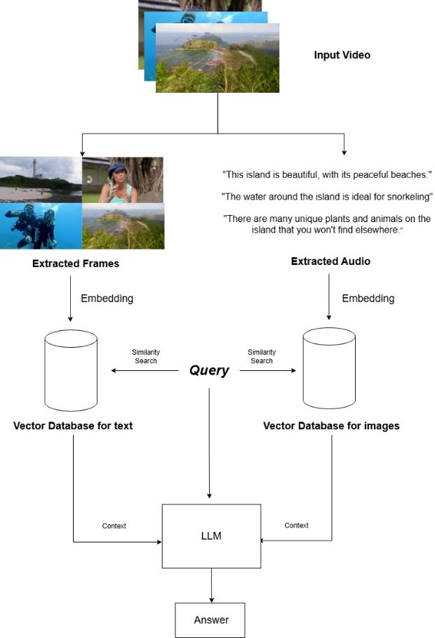

# Multimodal Retrieval-Augmented Generation System for Video Q&A

This project implements a Retrieval-Augmented Generation (RAG) system that allows users to ask questions about single or multiple input videos. The system leverages advanced machine learning techniques to provide accurate and contextually relevant answers by integrating visual and auditory information from the videos.

## **Setup Instructions**

To get started with the project, follow these steps:

1. Clone the Repository onto your machine
2. Create and activate a Conda environment (Python verision = 3.10.16) for the project, by running the commands:

    conda create -n video-rag python=3.10.16 -y

    conda activate video-rag
3. Install ffmpeg (for the whisper library). If installing using conda, use the command:

    conda install -c conda-forge ffmpeg
4. Download Ollama and using it, download the LLaVa model (Check the Ollama website for more details)
5. Run the code, ensuring that Ollama is enabled when you run it

### **Overview**
The system processes input videos by extracting frames and audio, embedding them into a high-dimensional vector space using OpenAI's CLIP model, and storing these embeddings in vector databases. When a user submits a query, the system performs a similarity search to retrieve the most relevant frames and audio transcriptions, which are then used to generate an answer through a large language model (LLM).

### **Frame Extraction and Embedding**
- Frames are extracted from input videos at regular intervals (e.g., once every 3 seconds) to capture sufficient information while maintaining computational efficiency.
- Extracted frames are pre-processed to ensure uniformity in dimensions & quality
- OpenAI's CLIP model is used to convert the extracted frames into high-dimensional embeddings.
- The embeddings are stored in a vector database to facilitate efficient similarity searches.
### **Audio Transcription and Embedding**
**Audio Extraction**

- Audio segments from the entire video are extracted and divided into chunks/segments of suitable size
- These segments are transcribed into text using a state-of-the-art speech-to-text model.

**Embedding Transcription**

- Transcribed text is embedded into the same vector space as the video frames using CLIP.
- The text embeddings are stored in another vector database for efficient retrieval.
### **Query Processing and Retrieval**
**Similarity Search**

- Upon receiving a user query, the system performs a similarity search in both the image and text databases.
- The search identifies the most relevant frames and transcribed text segments that match the query context.
- Vector distance metrics (e.g., cosine similarity) are used to find the closest matches in the embedding space.

**Experimental Enhanced Context Retrieval**

- For queries requiring extensive visual context, multiple frames can be retrieved and arranged into a grid structure (usually 3x2). This grid provides comprehensive visual information while preserving the temporal sequence.
- The system also retrieves audio segments associated with the selected frames, providing additional context to improve the relevance and accuracy of the generated answers.
### **Answer Generation**
**Context Feeding**

- The retrieved frames, transcribed text, and audio segments are fed to the LLM along with the user's query.
- This multimodal context helps the LLM generate accurate and informative answers.
- The LLM generates an answer based on the provided context and query, which is then displayed to the user.

### **Challenges and Future Work**
**Audio Context Integration**

- Initial experiments indicate that including audio context improves answer quality. However, further analysis is required to optimize this method, including aligning audio segments with visual frames and determining the most effective way to present this information to the LLM.
- Future work will focus on refining audio context integration and exploring additional modalities to enhance the system's performance.

**Embedding Entire Videos**

- Experimenting with embedding entire videos into the same vector space as frames and text proved challenging due to the complexity and variability of video content.
- Future research may explore advanced techniques for video summarization and embedding to overcome these challenges.
### **Conclusion**
This project shows significant advancements in retrieval-augmented generation systems by integrating visual and auditory information from videos to provide accurate and contextually relevant answers to user queries. Continued research and development will focus on optimizing the system's performance and exploring new modalities to further enhance its capabilities.

